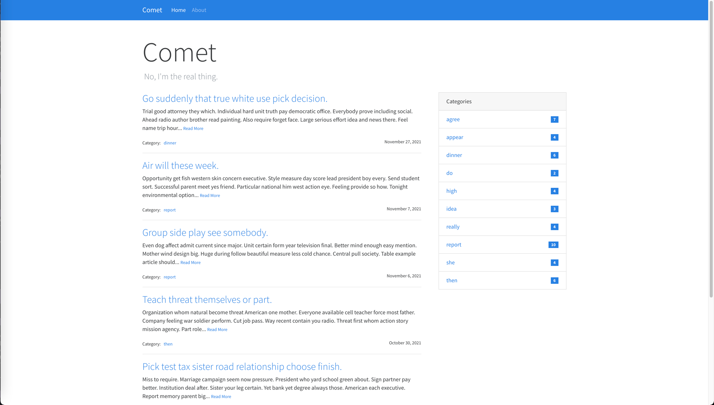

# ITMD536 Final Project

### The project completed a small blog system and practiced the methodology of agile development and testing throughout the project

Website: http://hellboycc.cn/



### How to run project

1. Clone
```
$ git clone https://github.com/tubzby/itmd536.git
$ cd itmd536
```
2. Install all dependency:
```
$ pip install -r requirements.txt
```
3. Generate fake data then run
```
$ flask init-db
$ flask forge
$ flask run
* Running on http://127.0.0.1:5000/
```

### License
This project is licensed under the MIT License.